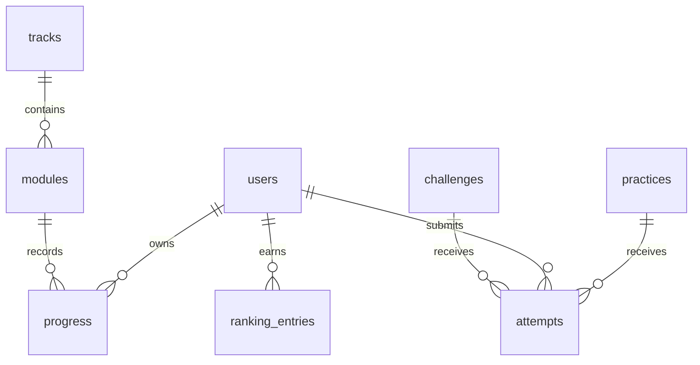

# Modelagem inicial do banco

Todos os identificadores são UUIDs; datas usam UTC. Conteúdo publicado possui `slug` único e ordenação explícita.

## Entidades

- `users`: id, email único, password_hash opcional, display_name, role, created_at, updated_at.
- `tracks`: id, slug, title, description, status, position.
- `modules`: id, track_id, slug, title, content_version, position, published_at.
- `practices`: id, module_id opcional, kind, slug, title, difficulty, specification.
- `progress`: user_id, module_id, state (`idle`, `started`, `completed`), started_at, completed_at, content_version; chave composta por usuário e módulo.
- `challenges`: id, slug, title, specification, points, published_at.
- `attempts`: id, user_id, practice_id ou challenge_id, status, score, submitted_at, metadata JSONB limitado.
- `ranking_entries`: user_id, season, points, updated_at; chave composta por usuário e temporada.

## Integridade e privacidade

Chaves estrangeiras de conteúdo usam exclusão restrita; dados pertencentes ao usuário usam exclusão em cascata. E-mail não aparece em ranking. Índices cobrem slugs, progresso por usuário e tentativas por desafio. A API deve validar que exatamente um destino de tentativa foi informado e aplicar limite de tamanho ao JSON. Backups, retenção e exclusão de conta devem fazer parte da operação antes de armazenar dados reais.
